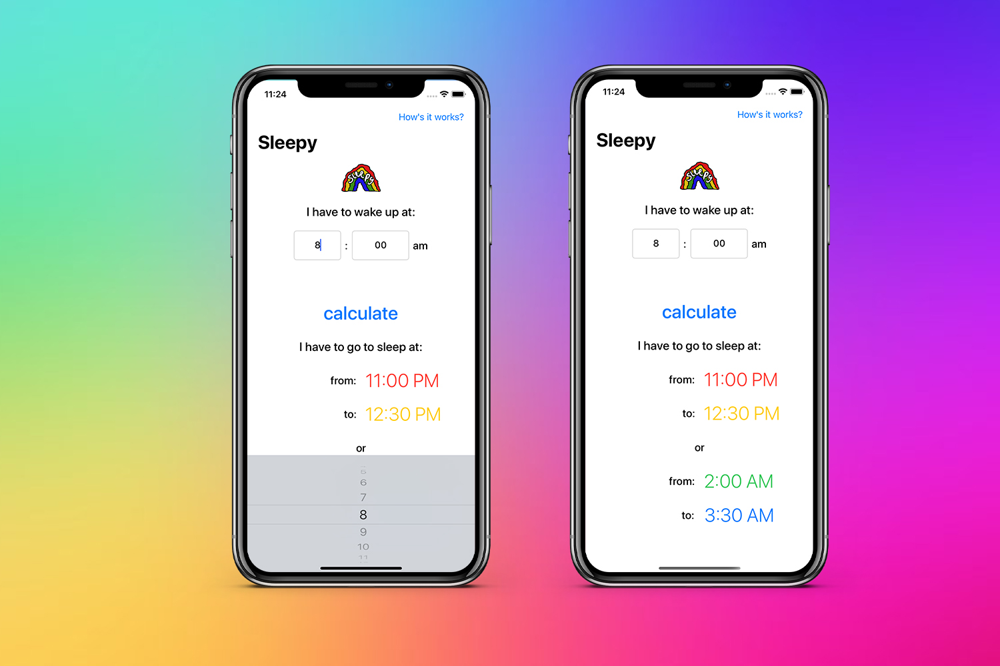

# Sleepy

This app allows you to track the time when you need to go to sleep. The app takes data recommended by experts, and also sends notifications so that the user finds out when he needs to go to bed.

## Screenshots

## License

Magnetic is available under the MIT license. See the LICENSE file for more info.
